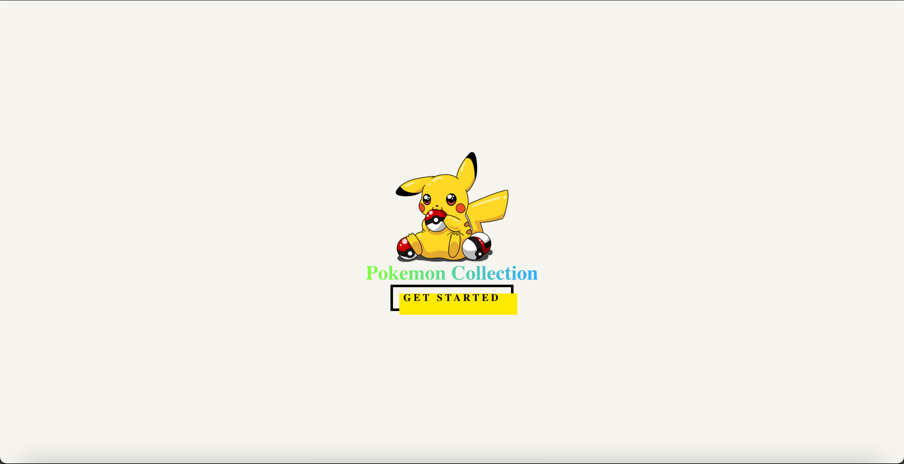

## Homepage
[https://pokepedia-gamma.vercel.app/](https://pokepedia-gamma.vercel.app/)

## Features
1. Catch Pokemon
2. Release Pokemon
3. Show Detail Pokemon
4. My Pokemon
5. Profile

## How to run

1. Using terminal

`git clone https://github.com/paulusapr/pokepedia.git && cd pokepedia && npm install && npm run dev`

hit our application in a browser at http://localhost:3000/

## Application Stack

1. [ReactJs](https://reactjs.org/) A JavaScript library for building user interfaces.
2. [NextJs](https://nextjs.org/) Server side framework for ReactJs.
3. [Graphql Client](https://graphql.org/graphql-js/graphql-clients/) GraphQL client is code that makes a POST request to a GraphQL Server.
4. [Eslint](https://eslint.org/) JavaScript codes linter.
5. [MaterialUI](https://material-ui.com/) A popular React UI Framework

## Credits
- [The Unofficial GraphQL for PokeAPI](https://github.com/mazipan/graphql-pokeapi)
- [Vercel](https://vercel.com/)